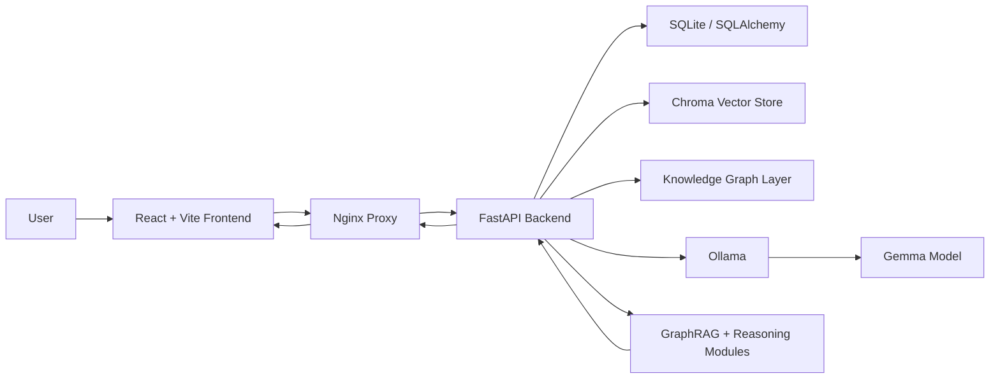

# Insight Weaver

> A Gemma-powered scientific discovery copilot that turns dense research papers into searchable evidence, knowledge graphs, contradiction maps, and testable hypotheses.

[](#)
[](#)
[](#)
[](#)

## Problem Statement

Scientific knowledge is growing faster than researchers can read, connect, and validate it. A single research question may require scanning dozens of papers, comparing methods, tracking conflicting claims, and identifying gaps that are still experimentally testable. Traditional search engines return documents. They do not explain how ideas connect, where evidence conflicts, or what new hypothesis is worth exploring next.

This creates a major bottleneck for students, researchers, doctors, biotech teams, and innovation labs:

- Literature reviews take weeks of manual reading.
- Important relationships are hidden across papers and sections.
- Contradictory results are hard to surface early.
- Research hypotheses are often generated from incomplete context.
- LLM answers can sound confident without being grounded in evidence.

Insight Weaver solves this by converting uploaded scientific papers into a structured discovery workspace powered by local Gemma inference through Ollama.

## What Insight Weaver Does

Insight Weaver is not just a PDF chatbot. It is a research reasoning system that combines retrieval, entity extraction, knowledge graphs, and Gemma-based generation into one workflow.

1. Upload research papers

   Users upload PDFs directly into the web app. The backend parses the paper, extracts metadata, chunks sections, and stores the processed evidence.

2. Build a scientific knowledge layer

   The system extracts scientific entities such as diseases, methods, datasets, genes, proteins, metrics, and concepts. It also maps relationships between them and creates a graph-grounded view of the literature.

3. Ask evidence-grounded questions

   GraphRAG combines semantic retrieval with graph context. Answers are grounded in retrieved chunks, paper IDs, sections, entities, and relationships instead of unsupported model memory.

4. Detect contradictions across papers

   Insight Weaver compares claims across selected papers and highlights disagreement in results, methods, causal claims, or conclusions.

5. Generate testable hypotheses

   Using Gemma through Ollama, the system generates structured research hypotheses with reasoning, supporting evidence, confidence, novelty, testability, suggested experiments, and falsifiable conditions.

6. Explore the research landscape

   The app helps identify dominant themes, research gaps, cross-paper connections, and promising future directions.

## Why This Is Different

Most AI research assistants stop at summarization. Insight Weaver goes further:

- It treats papers as structured scientific evidence, not just text blobs.
- It combines lexical search, vector retrieval, and graph relationships.
- It gives fast fallback answers even when model calls are slow.
- It uses Gemma locally via Ollama, keeping inference portable and reproducible.
- It supports contradiction detection and hypothesis generation, which are closer to real research work than simple Q&A.
- It is fully Dockerized for one-command deployment.

## Product Experience

The frontend is designed as a research cockpit:

- Upload and process PDF papers.
- View indexed paper status.
- Ask GraphRAG questions.
- Inspect generated answers and evidence.
- Visualize knowledge graph neighborhoods.
- Generate hypotheses from uploaded literature.
- Run contradiction, connection, and landscape analysis.
- Monitor the Gemma/Ollama model status from the UI.

## Architecture



## Core Modules

| Layer | Responsibility |
| --- | --- |
| Frontend | React research workspace for upload, GraphRAG, graph view, hypotheses, and analysis |
| API | FastAPI service exposing papers, search, graph, agents, hypothesis, and analysis endpoints |
| Ingestion | PDF parsing, metadata extraction, section chunking, paper processing |
| Retrieval | Semantic search, vector store integration, GraphRAG answer construction |
| Reasoning | Entity extraction, relationship mapping, contradiction detection, cross-paper reasoning |
| Model Interface | Ollama client wrapper for Gemma generation, structured JSON generation, and warmup |
| Deployment | Docker Compose stack for frontend, backend, Ollama, model pull, and public tunnel |

## Tech Stack

- **Frontend:** React, Vite, Lucide React, React Markdown, Force Graph
- **Backend:** FastAPI, SQLAlchemy Async, Pydantic Settings, Uvicorn
- **AI / LLM:** Gemma via Ollama
- **Retrieval:** ChromaDB, sentence-transformers, GraphRAG
- **Scientific NLP:** spaCy, SciSpaCy, PyMuPDF, pdfplumber
- **Data:** SQLite by default, with async SQLAlchemy; Chroma for vectors
- **Deployment:** Docker, Docker Compose, Nginx, Cloudflare Tunnel support

## Repository Structure

```text
Insight-Weaver/
├── backend/
│   ├── api/              # FastAPI app and routes
│   ├── core/             # Config, Gemma engine, model warmup
│   ├── graph/            # Knowledge graph builder and queries
│   ├── ingestion/        # PDF parsing, metadata, chunking
│   ├── reasoning/        # Entity extraction, contradictions, cross-paper reasoning
│   ├── retrieval/        # Semantic search, vector store, GraphRAG
│   ├── schemas/          # API request/response schemas
│   └── tasks/            # Paper processing pipeline
├── frontend/
│   ├── src/              # React application
│   ├── Dockerfile        # Production frontend image
│   └── nginx.conf        # Static serving and API proxy
├── docker-compose.yml    # Full app + Ollama deployment
├── DEPLOY_OLLAMA_DOCKER.md
└── README.md
```

## Quick Start With Docker and Ollama

Prerequisites:

- Docker Desktop
- At least 12 GB free disk for the default Gemma model
- Enough memory for local inference

```powershell
git clone https://github.com/Venkat-023/Insight-Weaver.git
cd Insight-Weaver
Copy-Item .env.example .env
docker compose up --build
```

Open:

- App: `http://localhost:8080`
- Backend health: `http://localhost:8000/health`
- Ollama API: `http://localhost:11434`

The default model is:

```env
OLLAMA_MODEL=gemma4:e4b
```

To use a lighter model, edit `.env`:

```env
OLLAMA_MODEL=gemma4:e2b
```

Then run:

```powershell
docker compose up --build
```

## Public Demo Tunnel

For hackathon demos or placement reviews, the stack includes a Cloudflare quick tunnel service.

```powershell
docker compose up -d public-tunnel
docker logs gemma-hackathon-public-tunnel
```

Copy the generated `trycloudflare.com` URL from the logs. The link remains active while your machine, Docker Desktop, and the tunnel container are running.

For a production-grade public URL, use a named Cloudflare Tunnel or deploy the same Docker stack to a VPS or cloud VM.

## Hugging Face Spaces Deployment

The repository also includes a root `Dockerfile` for Hugging Face Spaces. Unlike local Docker Compose, Spaces run a single container, so this image bundles:

- React frontend
- FastAPI backend
- Nginx reverse proxy
- optional local Ollama runtime

The Space listens on port `7860`.

Recommended Space settings:

```env
OLLAMA_MODEL=gemma4:e2b
```

For stronger always-on inference, use an external Ollama/Ollama Cloud endpoint:

```env
USE_EXTERNAL_OLLAMA=true
OLLAMA_HOST=<your-ollama-endpoint>
OLLAMA_MODEL=<model-tag>
```

If local Ollama is used inside the Space, enable persistent storage so the model does not need to be downloaded again after every restart.

## Local Development

Backend:

```powershell
cd backend
python -m venv .venv
.\.venv\Scripts\Activate.ps1
pip install -r requirements.txt
pip install aiosqlite==0.20.0
uvicorn api.main:app --host 127.0.0.1 --port 8000
```

Frontend:

```powershell
cd frontend
npm install
npm run dev
```

Open `http://127.0.0.1:5173`.

## Key API Capabilities

| Endpoint | Purpose |
| --- | --- |
| `POST /api/v1/papers/upload` | Upload and process a PDF |
| `GET /api/v1/papers/` | List indexed papers |
| `POST /api/v1/search/graphrag` | Ask graph-grounded research questions |
| `GET /api/v1/graph/{paper_id}` | Export graph for a paper |
| `POST /api/v1/hypothesis/generate` | Generate testable hypotheses |
| `POST /api/v1/analysis/contradictions` | Detect contradictions across papers |
| `POST /api/v1/analysis/connections` | Find cross-paper connections |
| `POST /api/v1/analysis/landscape` | Analyze a research topic landscape |
| `GET /api/v1/agents/model-status` | Check Gemma/Ollama readiness |

## Example Workflow

1. Start the Docker stack.
2. Upload two or more scientific PDFs.
3. Wait until processing is complete.
4. Ask a GraphRAG question such as:

   ```text
   What methods are most effective for lesion detection and where do the papers disagree?
   ```

5. Open the graph tab to inspect extracted concepts and relationships.
6. Generate hypotheses from the uploaded papers.
7. Run contradiction analysis on a topic.
8. Use suggested experiments and falsifiable conditions as starting points for research planning.

## Innovation Highlights

- **Graph-grounded generation:** Gemma responses are anchored in retrieved evidence and extracted relationships.
- **Scientific contradiction detection:** The system looks for conflicting claims instead of only summarizing consensus.
- **Hypothesis engine:** Generates structured, testable, falsifiable hypotheses rather than generic ideas.
- **Local-first AI deployment:** Ollama keeps Gemma inference portable and avoids dependency on hosted LLM APIs.
- **Research-grade UX:** The app supports the full loop from paper upload to graph exploration to research planning.
- **Dockerized reproducibility:** Frontend, backend, Ollama, model pull, and public tunnel run from Compose.

## Current Deployment Status

This project has been containerized with:

- Frontend served by Nginx on port `8080`
- Backend served by FastAPI on port `8000`
- Ollama served on port `11434`
- Gemma model configured through `OLLAMA_MODEL`
- Upload proxy limit increased for larger PDFs
- Optional Cloudflare public tunnel

## Future Roadmap

- Named Cloudflare Tunnel or VPS deployment for permanent public access
- User-level workspaces and persistent auth
- Citation export to BibTeX and RIS
- Paper comparison dashboards
- Neo4j-backed graph exploration in production mode
- Streaming Gemma responses
- Evaluation suite for groundedness, contradiction quality, and hypothesis novelty

## Why This Matters

Insight Weaver compresses the early research cycle from days into minutes. It helps a researcher move from "I have papers" to "I understand the evidence, conflicts, graph structure, and next experiments." That is the difference between search and discovery.

Built for the Kaggle Gemma hackathon, but designed like a real research product.
