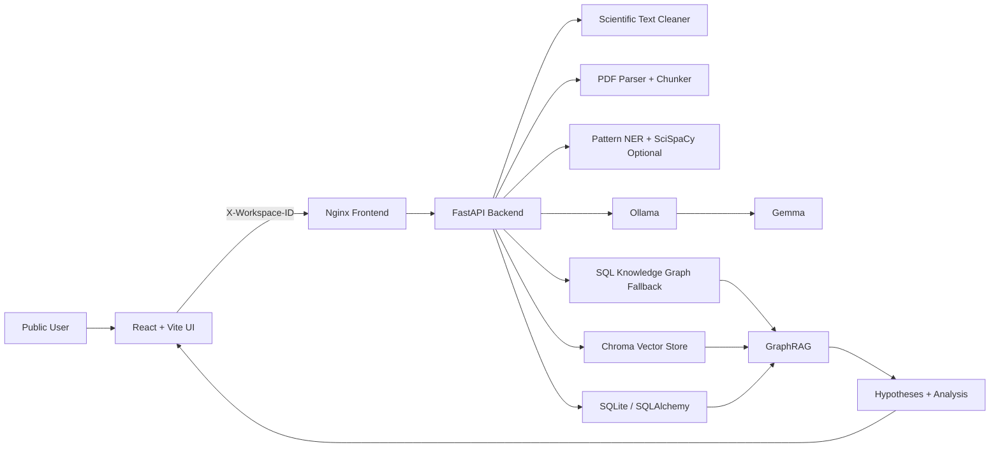

# Insight Weaver

> A Gemma + Ollama powered scientific discovery copilot that converts research papers into clean evidence, scientific entities, knowledge graphs, GraphRAG answers, contradiction analysis, and paper-specific testable hypotheses.

[](#)
[](#)
[](#)
[](#)

## Problem Statement

Modern scientific knowledge is expanding faster than researchers can read, connect, and validate it. A single research question can require dozens of papers, each with different methods, datasets, claims, limitations, and contradictions. Search engines return documents, and generic chatbots summarize text, but neither reliably answers the deeper research question:

```text
What does this literature prove, where does it disagree, what entities connect across papers,
and what hypothesis should be tested next?
```

Insight Weaver addresses this gap by treating PDFs as structured scientific evidence. It parses papers, cleans noisy PDF text, extracts scientific entities, builds a local graph, retrieves relevant evidence, and uses Gemma through Ollama only after the evidence layer has been built. The result is a research workspace that moves from reading to reasoning.

## What It Does

- Upload scientific PDFs and process them into structured paper records.
- Clean PDF extraction artifacts such as ligatures, broken hyphenation, citations, page headers, table rows, and noisy newlines.
- Detect titles, authors, abstracts, sections, and high-value evidence chunks.
- Extract scientific entities such as proteins, genes, diseases, chemicals, methods, datasets, pathways, organisms, and concepts.
- Build graph views connecting papers, entities, mentions, and extracted relationships.
- Run GraphRAG over retrieved chunks plus graph context.
- Generate hypotheses that mention actual entities and evidence from uploaded papers rather than generic research advice.
- Detect contradictions and unexplored connections across selected papers.
- Give every public visitor a private anonymous workspace so they never see another visitor's papers, graph, hypotheses, or analysis results.

## UI Sections

The frontend exposes the research workflow as separate workspace sections:

- `Workspace` for PDF upload and ingestion progress.
- `Library` for reviewing indexed papers, parsed metadata, and processing status.
- `GraphRAG` for asking evidence-grounded questions over retrieved chunks plus graph context.
- `Knowledge Graph` for directly exploring the stored graph by paper or by entity.
- `Hypotheses` for generating testable, evidence-backed research hypotheses from uploaded papers.
- `Cross-Paper Analysis` for contradiction checks, connection discovery, and topic landscape review.
- `Discovery` for turning the latest GraphRAG result into a compact research brief.

Important distinction:

- `GraphRAG` is the question-answering surface. It retrieves evidence, synthesizes an answer, and shows the answer-specific evidence graph.
- `Knowledge Graph` is the graph exploration surface. It lets the user inspect stored nodes and edges directly without first asking a question.

## Why It Is Different

Insight Weaver is not a PDF chatbot. It is a scientific claim and evidence pipeline.

```text
Wrong model:   PDF -> LLM -> answer
Right model:   PDF -> clean text -> chunks -> entities -> graph -> retrieval -> Gemma reasoning
```

The LLM is the final reasoning layer, not the first parser. This design makes the output more inspectable, more grounded, and more useful for real research review.

## Corrected Sprint Fixes

This version implements the judge-focused corrected sprint plan:

| Area | Previous Risk | Current Fix |
| --- | --- | --- |
| PDF text quality | Raw PDF artifacts polluted chunks and prompts | Added `ScientificTextCleaner` for standard and aggressive cleaning |
| Sentence splitting | Naive punctuation splitting broke `et al.`, `Fig.`, decimals | Added `ScientificSentenceSplitter` with scientific boundary handling |
| Title/author parsing | Largest font could select journal logos or headers | Added position, font, metadata exclusion, and affiliation filtering |
| Section detection | Missed numbered and variant headings | Expanded vocabulary and normalized numeric/Roman prefixes |
| Entity extraction | Keyword lookup produced tiny graphs | Added pattern NER for biomedical/scientific methods, datasets, proteins, genes, diseases, chemicals |
| Hypotheses | Generic fallback dominated outputs | Fallback now uses retrieved chunks and extracted entities |
| GraphRAG merge | DB and Chroma IDs did not deduplicate | Uses `chroma_embedding_id` as canonical chunk identity |
| Lexical search | Broad `iLIKE` scans caused noisy retrieval | Uses candidate fetch plus BM25-style scoring |
| SQL graph fallback | Returned only paper-to-entity mentions | Also returns entity-to-entity relationship edges |
| Public demo privacy | All visitors shared one global database view | Added per-browser workspace isolation and reset |
| Docker startup | Race conditions around model readiness | Added health-gated Compose startup |

## Architecture



## Core Pipeline

1. **Workspace creation**  
   The frontend creates an anonymous UUID in `sessionStorage` and sends it as `X-Workspace-ID` on every user-data request.

2. **PDF ingestion**  
   Uploaded PDFs are stored under a workspace-specific upload path. A `Paper` row is created with `processing` status.

3. **Parsing and cleaning**  
   PyMuPDF extracts structured text and layout metadata. The cleaner normalizes ligatures, line breaks, citations, table noise, page numbers, formula spacing, and running headers.

4. **Section-aware chunking**  
   The chunker splits scientific text into sentence-boundary chunks, keeps important sections compact, and scores chunks by section and claim density.

5. **Entity extraction**  
   Pattern NER identifies scientific entities. SciSpaCy can contribute when installed. Entities are deduplicated with canonical keys and scoped to the visitor workspace.

6. **Graph building**  
   Paper-to-entity mentions and entity-to-entity relationships are persisted in SQL. Neo4j remains optional, but SQL fallback now supports usable graph visualization.

7. **Retrieval and GraphRAG**  
   Database candidates are scored with BM25-style ranking. Vector hits, when enabled, are merged by `chroma_embedding_id`. Graph context contributes entities, relationships, and paper evidence.

8. **Gemma reasoning**  
   Gemma receives raw retrieved evidence, key entities, relationships, and gaps. If Gemma fails, deterministic fallback hypotheses still use current paper entities and evidence.

9. **Reset and privacy**  
   A visitor can reset their workspace. The backend deletes their papers, chunks, entities, relationships, hypotheses, contradictions, uploads, and vector records without touching other visitors.

## Tech Stack

| Layer | Technology |
| --- | --- |
| Frontend | React, Vite, Lucide React, React Markdown, Force Graph |
| Backend | FastAPI, SQLAlchemy Async, Pydantic, Uvicorn |
| Model Runtime | Ollama + Gemma |
| Retrieval | ChromaDB, sentence-transformers, BM25-style candidate scoring |
| NLP / PDF | PyMuPDF, pdfplumber, spaCy, SciSpaCy optional |
| Data | SQLite by default, workspace-scoped tables, Chroma metadata filters |
| Deployment | Docker Compose, Nginx, Cloudflare quick tunnel |

## Repository Structure

```text
Insight-Weaver/
├── backend/
│   ├── api/              # FastAPI app, routes, workspace isolation
│   ├── core/             # Gemma engine, config, hypothesis generation
│   ├── graph/            # Optional Neo4j graph builder
│   ├── ingestion/        # PDF parser, metadata extractor, chunker
│   ├── preprocessing/    # Scientific text cleaner and sentence splitter
│   ├── reasoning/        # Entity extraction, contradictions, cross-paper reasoning
│   ├── retrieval/        # Vector store, semantic search, GraphRAG
│   ├── schemas/          # Pydantic request/response schemas
│   └── tasks/            # Paper processing pipeline
├── frontend/
│   ├── src/              # React app
│   ├── Dockerfile        # Frontend production image
│   └── nginx.conf        # Static serving and API proxy
├── deploy/               # Optional cloud deployment guides
├── docker-compose.yml    # Full local app + Ollama + tunnel stack
├── DEPLOY_OLLAMA_DOCKER.md
├── Processlogic.md
└── README.md
```

## Quick Start

Prerequisites:

- Docker Desktop
- Enough disk space for the selected Gemma model
- Enough memory for local Ollama inference

```powershell
git clone https://github.com/Venkat-023/Insight-Weaver.git
cd Insight-Weaver
Copy-Item .env.example .env
docker compose up --build -d
```

Open:

- App: `http://localhost:8080`
- Backend health: `http://localhost:8000/health`
- Ollama: `http://localhost:11434`

The default model is:

```env
OLLAMA_MODEL=gemma4:e4b
```

For lower hardware usage:

```env
OLLAMA_MODEL=gemma4:e2b
```

## Health Checks

The backend health endpoint reports component-level status:

```powershell
Invoke-RestMethod http://localhost:8000/health
```

Expected healthy output:

```json
{
  "status": "ok",
  "components": {
    "database": "ok",
    "ollama": "ok",
    "models": ["gemma4:e4b"],
    "model_ready": true
  }
}
```

## Public Demo Link

The Compose stack includes a Cloudflare quick tunnel:

```powershell
docker compose up -d public-tunnel
docker logs gemma-hackathon-public-tunnel
```

The generated `trycloudflare.com` URL is temporary and remains active only while Docker and the host machine are running. For a permanent production URL, use a named Cloudflare Tunnel or deploy the same Compose stack to a VPS.

## Workspace Isolation

Public visitors are isolated by anonymous browser session:

- The frontend stores `iw_workspace_id` in `sessionStorage`.
- Every API request that touches user data sends `X-Workspace-ID`.
- Backend routes reject missing or invalid workspace IDs.
- Papers, entities, hypotheses, contradictions, uploads, and vector metadata are workspace-scoped.
- A reset action calls `DELETE /api/v1/workspace/current`.

This prevents one visitor from seeing another visitor's uploads, graph, search results, hypotheses, or analysis history.

## Key API Endpoints

| Endpoint | Purpose |
| --- | --- |
| `GET /health` | Component health for DB, Ollama, and model readiness |
| `POST /api/v1/papers/upload` | Upload and process a PDF |
| `GET /api/v1/papers/` | List current workspace papers |
| `POST /api/v1/search` | Run GraphRAG search |
| `POST /api/v1/search/semantic` | Run vector semantic search |
| `GET /api/v1/graph/{paper_id}` | Load paper graph |
| `GET /api/v1/graph/entity/{entity_name}` | Load entity neighborhood |
| `POST /api/v1/hypothesis/generate` | Generate evidence-grounded hypotheses |
| `POST /api/v1/analysis/contradictions` | Detect contradictions across selected papers |
| `POST /api/v1/analysis/connections` | Find cross-paper connections |
| `POST /api/v1/analysis/landscape` | Analyze a topic landscape |
| `DELETE /api/v1/workspace/current` | Reset the current anonymous workspace |

All `/api/v1/*` user-data routes require:

```http
X-Workspace-ID: <uuid-v4>
```

## Example Workflow

1. Start the Docker stack.
2. Open `http://localhost:8080`.
3. Upload one or more PDFs.
4. Wait for processing to complete.
5. Open the graph tab and inspect extracted entities.
6. Ask a GraphRAG question.
7. Generate hypotheses and review evidence, experiments, and falsifiable conditions.
8. Run contradiction or connection analysis across selected papers.
9. Use Reset Workspace before a new demo or user session.

## Validation Status

The current implementation has been validated with:

- Frontend production build: `npm run build`
- Python syntax compilation across backend app files
- Smoke test for cleaner, sentence splitter, and pattern NER
- Docker Compose config validation
- Full Docker rebuild and restart
- Healthy backend, frontend, Ollama services
- `/health` returning DB/Ollama/Gemma readiness
- Workspace reset endpoint returning successfully

Note: full local `pytest` may require a clean Python environment. The checked machine had a global `py.py` shadowing pytest imports and a stale `.venv` pointing to a missing Python path, while the Docker runtime itself builds and runs correctly.

## Roadmap

- Add a clean Alembic migration set for non-SQLite production databases.
- Add stronger relationship extraction with calibrated evidence labels.
- Add named Cloudflare Tunnel or VPS deployment for permanent public access.
- Add streaming model responses.
- Add evaluation metrics for retrieval relevance, graph quality, and hypothesis groundedness.
- Add citation export and paper comparison reports.

## Why This Matters

Insight Weaver compresses the early research cycle from "I have a folder of papers" to "I understand the evidence, entities, conflicts, graph structure, and next testable experiments." It is designed for hackathon impact, but the architecture follows a real AI-RAG system principle: clean the evidence first, reason second, and make every output inspectable.
